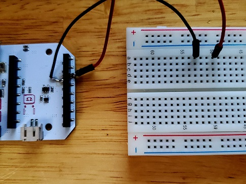
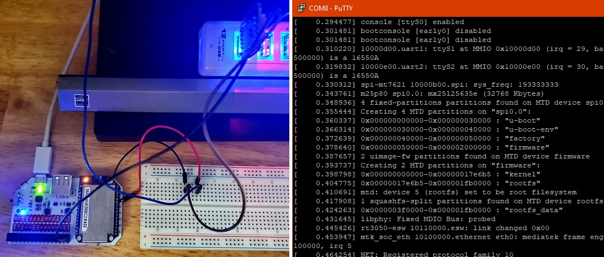

# onion-omega2-openwrt
Install openwrt on onion omega2+ for STA only mode.<br>
_This is NOT a walkthrough, it is for reference._

# Power Dock 2 - connect serial port of Onion Omega2+
If you are like me, you purchased a PowerDock 2 and for some reason, the manufacturer decided not to include Serial0 on thier fancy breakout header.  Would have been nice if they designed the pins to fit into a standard size breadboard like many other dev boards...

So I decided to just solder on a couple of wires to the RX0 TX0 pins on the PowerDock 2 so that I can use my own 3v3 USB-TTY converter.



Next, complete the TX, RX and GND Connections (remember RX-TX TX-RX).  Bring up a terminal on the correct COM port with settings of 115200 8,N,1,N.

Power on the device and the boot up sequence should show up in the terminal


# Install OpenWRT Firmware on Onion Omega2+
Download the latest openwrt firmware from https://openwrt.org/toh/hwdata/onion/onion_omega2plus

The latest edition at the time of this document was openwrt version 19.07.2.

scp or wget the openwrt firmware to the Omega2+ and execute a sysupgrade.

```
cd /tmp
wget http://downloads.openwrt.org/snapshots/targets/ramips/mt76x8/openwrt-ramips-mt76x8-onion_omega2p-squashfs-sysupgrade.bin
sysupgrade /tmp/openwrt-ramips-mt76x8-onion_omega2p-squashfs-sysupgrade.bin
```

The Omega2+ will reboot.  Once reboot is complete, an open openwrt wireless access point will be available for connection.

_note: My setup would not reboot if my usb-tty converter was connected. I had to remove all power from Omega2+ Power Dock 2 and pull the USB-TTY device from the usb port.  I would then power on the Omega, plug in the USB-TTY device and open a serial console port in a terminal in that exact order._

# Setup OpenWRT Onion Omega2+ for STA mode only
Get to a command line by either SSH or use the serial connection.
Modify /etc/config/network
```
vi /etc/config/network

# SHOULD LIKE SIMILAR TO THIS
config interface 'loopback'
        option ifname 'lo'
        option proto 'static'
        option ipaddr '127.0.0.1'
        option netmask '255.0.0.0'

config globals 'globals'
        option ula_prefix 'fdfc:7816:9cd8::/48'

config interface 'lan'
        option ifname 'eth0'
        option type 'bridge'
        option proto 'static'
        option netmask '255.255.255.0'
        option ip6assign '60'
        option ipaddr '192.168.100.1'

config switch
        option name 'switch0'
        option reset '1'
        option enable_vlan '0'

config interface 'wwan'
        option proto 'dhcp'
```

Modify /etc/config/wireless
```
vi /etc/config/wireless

# SHOULD LIKE SIMILAR TO THIS
config wifi-device 'radio0'
        option type 'mac80211'
        option channel '11'
        option hwmode '11gn'
        option path 'platform/10300000.wmac'
        option htmode 'HT20'
        option disabled '0'

config wifi-iface 'default_radio0'
        option device 'radio0'
        option network 'wwan'
        option mode 'sta'
        option encryption 'psk2'
        option key 'your_wifi_password'
        option ssid 'your_wifi_ssid'
```
Upon completion of network and wireless configuration, restart network service and try pinging something on the internet.
```
service network restart
[  793.450632] wlan0: authenticate with 00:11:22:33:44:55
[  793.464690] wlan0: send auth to 00:11:22:33:44:55 (try 1/3)
[  793.479471] wlan0: authenticated
[  793.489455] wlan0: associate with 00:11:22:33:44:55 (try 1/3)
[  793.517774] wlan0: RX AssocResp from 00:11:22:33:44:55 (capab=0x431 status=0 aid=1)

ping 1.1.1.1
64 bytes from 1.1.1.1: seq=0 ttl=57 time=22.484 ms
--- 1.1.1.1 ping statistics ---
1 packets transmitted, 1 packets received, 0% packet loss
```


